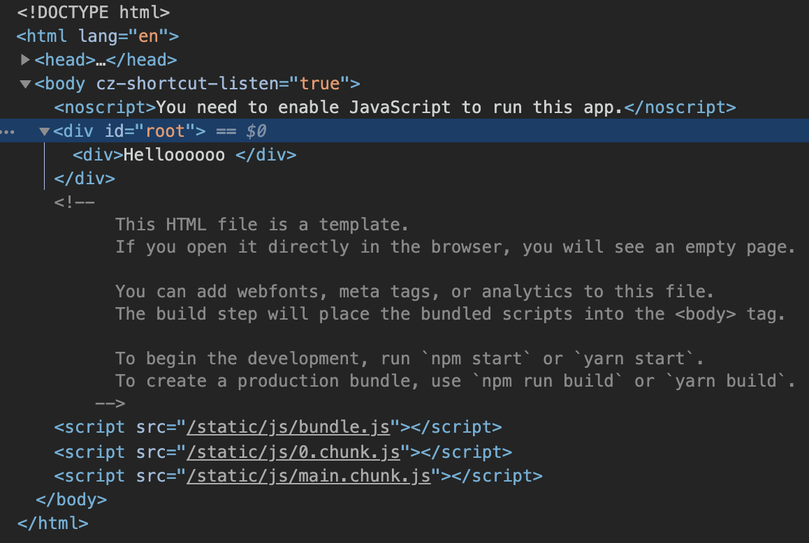
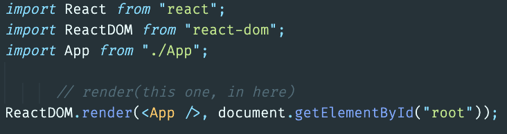

#### 1-2. How does React work?

```javascript
// app.js

function App() {
  return <div>Helloooooo </div>;
}

export default App;
```



<p>
이렇게 웹에서는 `div id="root"` 안에 우리가 작성한 코드가 있는 것처럼 보이지만 실제로 `public > index.html` 에서 코드를 보면 우리가 작성한 코드가 보이지 않는다. 오히려 root 안에 아무것도 없다!
</p>


그러면 리액트는 도대체 어떻게 작동하는 것인가?
React creates all the elements that I write on it, it creates with JS and it pushes them into HTML. That's why I don't see the HTML in `index.html`.

````javascript
<div id="root">
// React is in charge of putting elements in here.
// Puts all my react application in between this div.
</div>```
````



This makes React fast! React knows how to put HTML and remove HTML from the HTML without putting it in the source code at the beginning. So when the application loads, it will load an empty HTML, and then React is going to push the HTML that I wrote in my component. 👉🏼 **virtual DOM!**
<br/><br/>

---

[목록으로](../../README.md) / [다음으로](../chapter-02/README.md)

1. [SETUP](../chapter-01/README.md)
2. [JSX & PROPS](../chapter-02/README.md)
3. [STATE](../chapter-03/README.md)
4. [MAKING THE MOVIE APP](../chapter-04/README.md)
5. [CONCLUSIONS](../chapter-05/README.md)
6. [ROUTING BONUS](../chapter-06/README.md)
