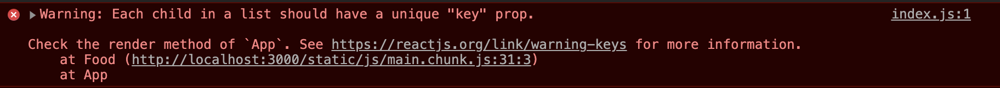

#### 2.0 Creating your first React Component

리액트가 계속 돌아가게 하고 싶다면 npm start를 해 서버를 실행하고 console을 종료하지 않아야 함.

##### What is Component?

컴포넌트: **A function that returns a HTML**.<br/>
it has to be like `<App />`. 리액트는 컴포넌트와 함께 동작한다. 즉, 리액트 내에서 컴포넌트를 쓰고 싶다면 마치 HTML 코드인 것처럼 `<App />` 과 같은 형식으로 써줘야 한다. 그리고 JS를 확장 해 JS 안에 html, JS 기능을 모두 포함하는 것을 jsx 라고 부른다.

###### How do we make a component?

src 안에 파일을 만들고 함수를 만들어 준다, 함수명은 대문자로 시작하자!

#### 2.1 Reusable Components with JSX + Props

리액트가 좋은 이유는 재사용이 가능한 컴포넌트를 만들수 있기 때문이다. 컴포넌트를 계속해서 반복해 사용할 수 있다는 것이다.
컴포넌트에서 (child)컴포넌트로 정보를 보내는 방법을 배워보자. App 컴포넌트에서 Food 컴포넌트로 정보를 보내고 Food 컴포넌트에서 받은 정보를 어떻게 사용할지 배워봅시다!

```JSX
<Food fav="potato" />
// component: Food
// prop(property): fav
// value: kimchi
```

누군가가 Food 컴포넌트로 정보를 보내려고 하면, 리액트는 안의 속성을 모두 가져온다. 그리고 그것을 Food 함수 컴포넌트의 argument로 넣는다! 👉🏼 props

```JSX
function Food(props) {
    return <h1> i love {props.fav} </h1>;
}
```

ES6 덕분에 `props.fav` 대신 `{fav}` 로 쓸 수 있게 되었다! 🙊

```JSX
function Food({fav}) {
    return <h1> i love {fav} </h1>;
}
```

#### 2.2 Dynamic Component Generation

```JSX
<Food fav="potato" />
<Food fav="chicken" />
<Food fav="pizza" />
<Food fav="pasta" />
```

이렇게 코드를 짜는 건 매우 비효율적임 ∵ 새로운 음식을 추가할 때 마다 복사& 붙여넣기 해야 하니까! 데이터는 원래 처음부터 우리가 갖고 있던 데이터가 아니다! 이 데이터들은 웹사이트에서 온 데이터들이다. 따라서 우리는 애초에 갖고 있지 않았던 데이터들을 복사 붙여넣기 할 수 없음. 따라서, 이 방법은 옳지 못하다.<br/>
<br/>
이제 우리는 데이터가 있다고 시뮬레이션을 해보자. 임의로 데이터를 만들고 이 데이터가 API에서 온 데이터라고 가정하자.

```JSX
// 임의로 만든 데이터

const foodILike = [
  {
    name: "KFC",
    image:
      "https://cdn.shortpixel.ai/client/q_glossy,ret_img,w_656/https://www.milanoevents.it/wp-content/uploads/2016/08/Kfc-milano.jpg",
  },
  {
    name: "Popeyes",
    image:
      "https://www.gannett-cdn.com/presto/2018/08/08/PHGL/8a55dc95-fb75-4711-8fde-8ea221478845-Popeyesjpg.jpg?crop=729,412,x0,y70&width=2560",
  },
  {
    name: "Yamyam chicken",
    image:
      "https://jesspryles.com/wp-content/uploads/2018/01/korean-fried-chicken-24.jpg",
  },
];

```

```JSX
function Food({ name, image }) {
  return (
    <div>
      <h4>I Love {name}</h4>
      
    </div>
  );
}

function App() {
  return (
    <div>
      {foodILike.map((plate) => (
        <Food name={plate.name} image={plate.image} />
      ))}
    </div>
  );
}
```

#### 2.3 map Recap

다음과 같이 함수를 쪼갤 수도 있다.

```JSX
function Food({ name, image }) {
  return (
    <div>
      <h1>i Love {name}</h1>
      
    </div>
  );
}

function renderFood(plate) {
  return <Food name={plate.name} image={plate.image} />;
}

function App() {
  return (
    <div>
      {console.log(foodILike.map(renderFood))}
      {foodILike.map(renderFood)}
    </div>
  );
}
```

그런데 콘솔창을 보면 이런 에러를 만날 수 있다.


이 말은 모든 리액트의 element들은 유일해야 하는데 리스트에 들어가면 uniqueness 를 잃어버림 👉🏼 리스트 내부의 요소들에게 id를 주자!

```JSX
const foodILike = [
  {
    id: 1,
    name: "KFC",
    image:
      "https://cdn.shortpixel.ai/client/q_glossy,ret_img,w_656/https://www.milanoevents.it/wp-content/uploads/2016/08/Kfc-milano.jpg",
  },
  {
    id: 2,
    name: "Popeyes",
    image:
      "https://www.gannett-cdn.com/presto/2018/08/08/PHGL/8a55dc95-fb75-4711-8fde-8ea221478845-Popeyesjpg.jpg?crop=729,412,x0,y70&width=2560",
  },
  {
    id: 3,
    name: "Yamyam chicken",
    image:
      "https://jesspryles.com/wp-content/uploads/2018/01/korean-fried-chicken-24.jpg",
  },
];

function App() {
  return (
    <div>
      {foodILike.map((plate) => (
        <Food key={plate.id} name={plate.name} image={plate.image} />
      ))}
    </div>
  );
}
```

요소마다 id 값을 주고 Food 컴포넌트에 프로퍼티로 id 값을 보내주면 완벽! 참고로 `key={plate.id}` 얘는 Food 컴포넌트 내부에서 사용하지 않는다. 그냥 리액트 내부에서 유일성을 주기 위해 사용하기 위한 것임.

#### 2.4 Protection with ProtoTypes

우리는 상위 컴포넌트로부터 전달받은 프로퍼티가 우리가 예상한(혹은 원했던) 프로퍼티인지 확인해야 할 필요가 있다. 👉🏼 prop-types 를 이용한다!

`npm i prop-types`

👩🏻‍🏫 prop-types 의 역할: 내가 전달받은 프로퍼티가 내가 원하는 프로퍼티인지 확인 해 준다. 우리는 사람이라 프로퍼티를 보내는 과정에서 실수 할 수 있기 때문에 이걸 쓰는게 좋음!

리스트 각각에 평점을 추가해 보자.

```JSX
const foodILike = [
  {
    id: 1,
    name: "KFC",
    image:
      "https://cdn.shortpixel.ai/client/q_glossy,ret_img,w_656/https://www.milanoevents.it/wp-content/uploads/2016/08/Kfc-milano.jpg",
    rating: 4
  },
  {
    id: 2,
    name: "Popeyes",
    image:
      "https://www.gannett-cdn.com/presto/2018/08/08/PHGL/8a55dc95-fb75-4711-8fde-8ea221478845-Popeyesjpg.jpg?crop=729,412,x0,y70&width=2560",
    rating: 3.8
  },
  {
    id: 3,
    name: "Yamyam chicken",
    image:
      "https://jesspryles.com/wp-content/uploads/2018/01/korean-fried-chicken-24.jpg",
    rating: 5
  },
];

function App() {
  return (
    <div>
      {foodILike.map((plate) => (
        <Food key={plate.id} name={plate.name} image={plate.image} />
      ))}
    </div>
  );
}
```

```JSX
// App.js

import PropTypes from "prop-types;

Food.propTypes = {
  // PropTypes 가 아니라 첫글자는 소문자!
  name: PropTypes.string.isRequired,
  image: PropTypes.string.isRequired,
  rating: PropTypes.number.isRequired,
};

function Food({ name, image, rating }) {
  return (
    <div>
      <h2>I Love {name}</h2>
      <h4>Rating: {rating}/5</h4>
      
    </div>
  );
}

function App() {
  return (
    <div>
      {foodILike.map((plate) => (
        <Food
          key={plate.id}
          name={plate.name}
          image={plate.image}
          rating={plate.rating}
        />
      ))}
    </div>
  );
}
```

`Food.propTypes` 에서 우리가 Food 컴포넌트에서 쓸 프로퍼티들을 지정해주고, 그 프로퍼티들의 타입들과 필수 여부 등을 작성해주면 프로퍼티의 유무 뿐 아니라 타입까지 확인할 수 있다 :) 예를 들어 `rating: PropTypes.string.isRequired` 라고 한다면, 에러를 만날 수 있다. ∵ 우리가 보내주는 데이터에 rating은 타입이 number 이기 때문!
`ComponentName.propTypes = { property: condition}`

## 전체코드

```JSX
import PropTypes from "prop-types";

const foodILike = [
  {
    id: 1,
    name: "KFC",
    image:
      "https://cdn.shortpixel.ai/client/q_glossy,ret_img,w_656/https://www.milanoevents.it/wp-content/uploads/2016/08/Kfc-milano.jpg",
    rating: 4,
  },
  {
    id: 2,
    name: "Popeyes",
    image:
      "https://www.gannett-cdn.com/presto/2018/08/08/PHGL/8a55dc95-fb75-4711-8fde-8ea221478845-Popeyesjpg.jpg?crop=729,412,x0,y70&width=2560",
    rating: 3.8,
  },
  {
    id: 3,
    name: "Yamyam chicken",
    image:
      "https://jesspryles.com/wp-content/uploads/2018/01/korean-fried-chicken-24.jpg",
    rating: 4.9,
  },
];

Food.propTypes = {
  // PropTypes 가 아님에 유의!
  name: PropTypes.string.isRequired,
  image: PropTypes.string.isRequired,
  rating: PropTypes.number.isRequired,
};

function Food({ name, image, rating }) {
  return (
    <div>
      <h2>I Love {name}</h2>
      <h4>Rating: {rating}/5</h4>
      
    </div>
  );
}

function App() {
  return (
    <div>
      {foodILike.map((plate) => (
        <Food
          key={plate.id}
          name={plate.name}
          image={plate.image}
          rating={plate.rating}
        />
      ))}
    </div>
  );
}

export default App;
```

---

[목록으로](../../README.md) / [이전으로](../chapter-01/README.md) / [다음으로](../chapter-03/README.md)

1. [SETUP](../chapter-01/README.md)
2. [JSX & PROPS](../chapter-02/README.md)
3. [STATE](../chapter-03/README.md)
4. [MAKING THE MOVIE APP](../chapter-04/README.md)
5. [CONCLUSIONS](../chapter-05/README.md)
6. [ROUTING BONUS](../chapter-06/README.md)
