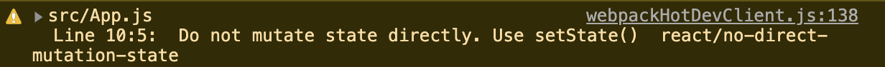

#### 3.0 Class Components and State

state는 보통 우리가 동적 데이터와 함께 작업할 때 만들어진다. <br/>
동적 데이터(dynamic data)란? 변하지 않는 데이터, 존재하지 않는 데이터, 생겨나고 사라지거나 변경된 데이터, 1인 데이터, 그리고 2가 되고 또는 0이 되는 데이터들.<br/>
For this, props are not gonna help us. What we need is `state`.<br/>
우리가 지금까지 작성해 사용한 Food 컴포넌트, 리스트로는 state를 쓸 수 없다. 왜냐면 우리가 작성했던 건 정적인 데이터니까!

<br/><br/>

```JSX
// 이걸 함수 컴포넌트라고 부른다

function App() {
  return (
    <div>
      {foodILike.map((plate) => (
        <Food
          key={plate.id}
          name={plate.name}
          image={plate.image}
          rating={plate.rating}
        />
      ))}
    </div>
  );
}
```

이번에는 class component를 만들어 보자.

```JSX
                 // necessary!
class App extends React.Component {}
```

매번 우리가 컴포넌트를 만들 때마다 모든 것을 다 구현하고 싶지 않다. That's why we extend from it. 예를 들어 baby는 human에서 확장되고, human의 모든 특징을 가져올 수 있음. 또 Samsung은 cell phone class 에서 확장된 것임. 휴대폰 앱을 개발한다고 하면 samsung 이나 apple을 프로그래밍 하지 않음, cell phone을 프로그래밍 하는 것임. Cell phone은 많은 attributes을 가지고 있음, 예를 들어 스크린, 카메라, 충전기 등. samsung and apple은 이런 것들은 공유한다. 따라서 그 attributes를 cell phone class에 넣읃 다음에, cell phone class에서 확장한 samsung class/apple class 를 갖게 되는 것.<br/>
즉, 우리는 `React.Component` 를 통해 React class 컴포넌트의 attribute를 가지면서 App으로 확장해 우리만의 컴포넌트를 만들 수 있음.<br/><br/>

class 컴포넌트는 return을 가지고 있지 않다 👉🏼 함수가 아니니까!<br/>
대신 render 메소드를 가지고 있다. React.Component 가 render 메소드를 가지고 있는데, 내가 React.Component 로부터 확장하기 때문에 나도 render method를 가지게 됨.

```JSX
class App extends React.Component {
  render() {
    return <h1>im a class component</h1>;
  }
}
```

React automatically is going to execute the render method of my class component.

Class 컴포넌트에는 state 라는 것이 있다. state는 컴포넌트의 동적인 데이터들을 넣을 수 있는 object이다. 여기서 동적인 데이터란 값이 변하는 데이터들을 말함. 즉, 바꿀 데이터를 state안에 넣는다. 이 state를 render() 안에서 보여주고 싶다면,

```JSX
class App extends React.Component {
  state = {
    count: 0,
  };
  render() {
                        // 이건 class 이기 때문에 this로 지정해주어야 함
    return <h1>The number is: {this.state.count}</h1>;
  }
}
```

#### 3.1 All you need to know about State

그러면 이제 state.count 값을 어떻게 바꿀 것인가를 알아봐야겠지?

```JSX
// 이렇게 작성하면 동작하지 않는다!!
class App extends React.Component {
  state = {
    count: 0,
  };
  plus = () => {
    this.state.count = 1;
  };
  minus = () => {
    this.state.count = -1;
  };
  render() {
    return (
      <div>
        <h1>The number is: {this.state.count}</h1>
        <button onClick={this.plus}>PLUS</button>
        <button onClick={this.minus}>MINUS</button>
      </div>
    );
  }
}
```

위의 코드가 동작하지 않는 이유는 무엇일까? <br/>
👉🏼 react는 render function을 refresh 하지 않기 때문!<br/>
무슨 말이냐면, state의 상태(숫자)가 바뀔 때 나는 react가 render function도 호출해서 바꿔주길 원한다. 하지만 그렇게 하지 않는다는 거지! 그러면서 콘솔창에 다음과 같은 경고창이 뜸.



우리가 setState 함수를 호출하면 리액트는 똑똑해서 우리가 언제 setState를 호출할 지 알고, 또 내가 언제 view를 refresh 하고 싶어하는지 알고, 언제 render function을 refresh하길 원하는 지 안다. 다시 말해, setState를 사용하지 않으면 새 state와 함께 render 함수가 호출되지 않음!!

```JSX
class App extends React.Component {
  state = {
    count: 0,
  };
  plus = () => {
    this.setState({ count: this.state.count + 1 });
  };
  minus = () => {
    this.setState({ count: this.state.count - 1 });
  };
  render() {
    return (
      <div>
        <h1>The number is: {this.state.count}</h1>
        <button onClick={this.plus}>PLUS</button>
        <button onClick={this.minus}>MINUS</button>
      </div>
    );
  }
}
```

그런데 이 방법은 state에 의존하고 있기 때문에 별로 좋은 방법이 아님! 리액트는 외부의 상태에 의존하지 않게 하기 위해 current 값을 함수 형태로 받아올 수 있게 제공하고 있음.

```JSX
  plus = () => {
    this.setState((current) => ({ count: current.count + 1 }));
  };
  minus = () => {
    this.setState((current) => ({ count: current.count - 1 }));
  };
```

> 매 순간 setState를 호출할 때 마다 리액트는 새로운 state와 함께 render function 을 새로 호출한다!<br/>
> Everytime I call setState, React is going to call the render function with the new state!

---

[목록으로](../../README.md) / [이전으로](../chapter-02/README.md) / [다음으로](../chapter-04/README.md)

1. [SETUP](../chapter-01/README.md)
2. [JSX & PROPS](../chapter-02/README.md)
3. [STATE](../chapter-03/README.md)
4. [MAKING THE MOVIE APP](../chapter-04/README.md)
5. [CONCLUSIONS](../chapter-05/README.md)
6. [ROUTING BONUS](../chapter-06/README.md)
