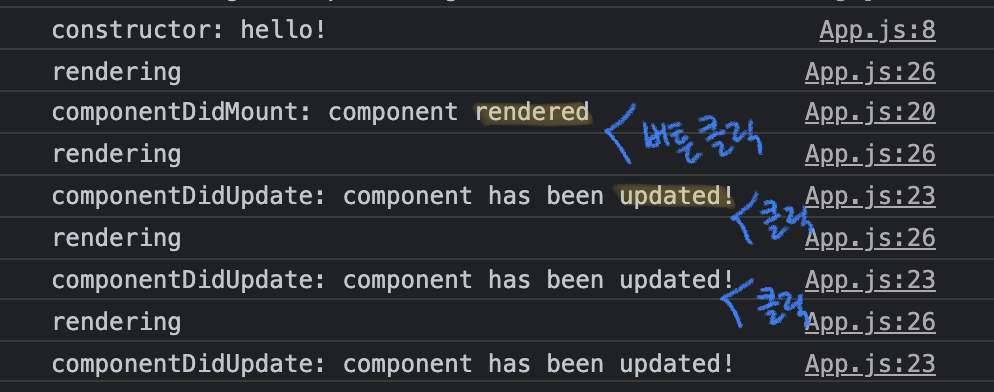

#### 3.0 Class Components and State

state는 보통 우리가 동적 데이터와 함께 작업할 때 만들어진다. <br/>
동적 데이터(dynamic data)란? 변하는 데이터, 존재하지 않는 데이터, 생겨나고 사라지거나 변경된 데이터, 1인 데이터, 그리고 2가 되고 또는 0이 되는 데이터들.<br/>
For this, props are not gonna help us. What we need is `state`.<br/>
우리가 지금까지 작성해 사용한 Food 컴포넌트, 리스트로는 state를 쓸 수 없다. 왜냐면 우리가 작성했던 건 정적인 데이터니까!

<br/><br/>

```JSX
// 이걸 함수 컴포넌트라고 부른다

function App() {
  return (
    <div>
      {foodILike.map((plate) => (
        <Food
          key={plate.id}
          name={plate.name}
          image={plate.image}
          rating={plate.rating}
        />
      ))}
    </div>
  );
}
```

이번에는 class component를 만들어 보자.

```JSX
                 // necessary!
class App extends React.Component {}
```

매번 우리가 컴포넌트를 만들 때마다 모든 것을 다 구현하고 싶지 않다. That's why we extend from it. 예를 들어 baby는 human에서 확장되고, human의 모든 특징을 가져올 수 있음. 또 Samsung은 cell phone class 에서 확장된 것임. 휴대폰 앱을 개발한다고 하면 samsung 이나 apple을 프로그래밍 하지 않음, cell phone을 프로그래밍 하는 것임. Cell phone은 많은 attributes을 가지고 있음, 예를 들어 스크린, 카메라, 충전기 등. samsung and apple은 이런 것들은 공유한다. 따라서 그 attributes를 cell phone class에 넣읃 다음에, cell phone class에서 확장한 samsung class/apple class 를 갖게 되는 것.<br/>
즉, 우리는 `React.Component` 를 통해 React class 컴포넌트의 attribute를 가지면서 App으로 확장해 우리만의 컴포넌트를 만들 수 있음.<br/><br/>

class 컴포넌트는 return을 가지고 있지 않다 👉🏼 함수가 아니니까!<br/>
대신 render 메소드를 가지고 있다. React.Component 가 render 메소드를 가지고 있는데, 내가 React.Component 로부터 확장하기 때문에 나도 render method를 가지게 됨.

```JSX
class App extends React.Component {
  render() {
    return <h1>im a class component</h1>;
  }
}
```

React automatically is going to execute the render method of my class component.

Class 컴포넌트에는 state 라는 것이 있다. state는 컴포넌트의 동적인 데이터들을 넣을 수 있는 object이다. 여기서 동적인 데이터란 값이 변하는 데이터들을 말함. 즉, 바꿀 데이터를 state안에 넣는다. 이 state를 render() 안에서 보여주고 싶다면,

```JSX
class App extends React.Component {
  state = {
    count: 0,
  };
  render() {
                        // 이건 class 이기 때문에 this로 지정해주어야 함
    return <h1>The number is: {this.state.count}</h1>;
  }
}
```

#### 3.1 All you need to know about State

그러면 이제 state.count 값을 어떻게 바꿀 것인가를 알아봐야겠지?

```JSX
// 이렇게 작성하면 동작하지 않는다!!
class App extends React.Component {
  state = {
    count: 0,
  };
  plus = () => {
    this.state.count = 1;
  };
  minus = () => {
    this.state.count = -1;
  };
  render() {
    return (
      <div>
        <h1>The number is: {this.state.count}</h1>
        <button onClick={this.plus}>PLUS</button>
        <button onClick={this.minus}>MINUS</button>
      </div>
    );
  }
}
```

위의 코드가 동작하지 않는 이유는 무엇일까? <br/>
👉🏼 react는 render function을 refresh 하지 않기 때문!<br/>
무슨 말이냐면, state의 상태(숫자)가 바뀔 때 나는 react가 render function도 호출해서 바꿔주길 원한다. 하지만 그렇게 하지 않는다는 거지! 그러면서 콘솔창에 다음과 같은 경고창이 뜸.


우리가 setState 함수를 호출하면 리액트는 똑똑해서 우리가 언제 setState를 호출할 지 알고, 또 내가 언제 view를 refresh 하고 싶어하는지 알고, 언제 render function을 refresh하길 원하는 지 안다. 다시 말해, setState를 사용하지 않으면 새 state와 함께 render 함수가 호출되지 않음!!

```JSX
class App extends React.Component {
  state = {
    count: 0,
  };
  plus = () => {
    this.setState({ count: this.state.count + 1 });
  };
  minus = () => {
    this.setState({ count: this.state.count - 1 });
  };
  render() {
    return (
      <div>
        <h1>The number is: {this.state.count}</h1>
        <button onClick={this.plus}>PLUS</button>
        <button onClick={this.minus}>MINUS</button>
      </div>
    );
  }
}
```

그런데 이 방법은 state에 의존하고 있기 때문에 별로 좋은 방법이 아님! 리액트는 외부의 상태에 의존하지 않게 하기 위해 current 값을 함수 형태로 받아올 수 있게 제공하고 있음.

```JSX
  plus = () => {
    this.setState((current) => ({ count: current.count + 1 }));
  };
  minus = () => {
    this.setState((current) => ({ count: current.count - 1 }));
  };
```

> 매 순간 setState를 호출할 때 마다 리액트는 새로운 state와 함께 render function 을 새로 호출한다!<br/>
> Everytime I call setState, React is going to call the render function with the new state!

#### 3.2 Component Life Cycle

리액트 컴포넌트에서 우리가 실제로 사용하는 render 함수가 유일하다. plus 함수와 minus 함수는 우리가 만든거니까! 하지만 리액트 클라스 컴포넌트는 단순히 render 말고 더 많은 걸 가지고 있다. 이들은 life cycle method 를 가지는데, 이는 기본적으로 리액트 컴포넌트를 생성하거나 소멸시키는 방법이다. 컴포넌트가 생성 될 때 render 되기 **전**에 호출되는 몇가지 함수가 있다. 그리고 컴포넌트가 render 된 **후** 호출되는 다른 함수들도 있다. 예를 들어 plus 버튼을 클릭해 +1, +1, +1 을 만들 때 호출되는 함수가 있고, 또 컴포넌트가 업데이트 될 때 호출되는 다른 함수도 있다는 것이다.

컴포넌트가 하는 3가지 일

1. mounting: mounting은 다시 태어나는 것, 즉 컴포넌트가 생성되는 것

   - 컴포넌트가 생성될 때 불리는 methods
     1. **constructor()** : 리액트에서 온 것이 아님. JS에서 클라스를 만들 때 호출됨
     2. static getDerivedStateFromProps()
     3. **render()**
     4. **componentDidmount()**

   이 순서대로 각각의 함수가 호출된다!

2. updating: 나로 인해서 업데이트 될 때 (plus/minus 를 클릭해 state를 변경할 때)
   - 컴포넌트가 업데이트 될 때 불리는 methods
     1. static getDerivedStateFromProps()
     2. shouldComponentUpdate()
     3. **render()**
     4. getSnapshotBeforeUpdate()
     5. **componentDidUpate()** : setState를 호출하면 컴포넌트를 호출하고 render를 호출한 다음 업데이트가 완료되면 componentDidUpdate가 실행됨.
3. unmounting: 컴포넌트가 소멸되는 것. 👉🏼 언제? 페이지를 바꿀 때 컴포넌트가 죽겠지! 아니면 state를 이용해서 컴포넌트를 교체하거나!
   - 컴포넌트가 소멸될 때 분리는 methods
     1. **componentWillUnmount()**

```JSX
import React from "react";

class App extends React.Component {
  constructor(props) {
    super(props);
    console.log("constructor: hello!");
  }
  state = {
    count: 0,
  };
  plus = () => {
    this.setState((current) => ({ count: current.count + 1 }));
  };
  minus = () => {
    this.setState((current) => ({ count: current.count - 1 }));
  };
  componentDidMount() {
    console.log("componentDidMount: component rendered");
  }
  componentDidUpdate() {
    console.log("componentDidUpdate: component has been updated!");
  }
  render() {
    console.log("rendering");
    return (
      <div>
        <h1>The number is: {this.state.count}</h1>
        <button onClick={this.plus}>PLUS</button>
        <button onClick={this.minus}>MINUS</button>
      </div>
    );
  }
}

export default App;
```



#### 3.3 Planning the Movie Component

이제 movie 컴포넌트를 구성해볼 시간!<br/>

**🐳 큰 그림을 그려봅시다 🐳**

```JSX
import React from "react";

class App extends React.Component {
  state = {
    isLoading: true, // 마운트 되자마자 isLoading은 당연히 true가 된다
  };
  componentDidMount() {
    // 컴포넌트 렌더링이 끝나자마자 호출된다
    setTimeout(() => {
      this.setState({ isLoading: false });
    }, 5000);
  }
  render() {
    const { isLoading } = this.state; // ES6 magic
    return <div>{isLoading ? "Loading" : "We are ready"}</div>;
  }
}

export default App;
```

로딩중일 때(isLoading이 true인 동안) 영화 데이터를 fetch 하고, fetch가 다 되면(componentdidMount()가 호출될 때) 불러온 데이터를 보여주면 된다!!

여기서 추가로, state에 초기 지정 없이 내가 원하는 setState에 값을 추가해줘도 된다. 예를 들어<br/>

```JSX
setState({ isLoading: true, book: true ...})  // book의 값을 state에 지정하지 않아도 괜찮음
```

---

[목록으로](../../README.md) / [이전으로](../chapter-02/README.md) / [다음으로](../chapter-04/README.md)

1. [SETUP](../chapter-01/README.md)
2. [JSX & PROPS](../chapter-02/README.md)
3. [STATE](../chapter-03/README.md)
4. [MAKING THE MOVIE APP](../chapter-04/README.md)
5. [CONCLUSIONS](../chapter-05/README.md)
6. [ROUTING BONUS](../chapter-06/README.md)
