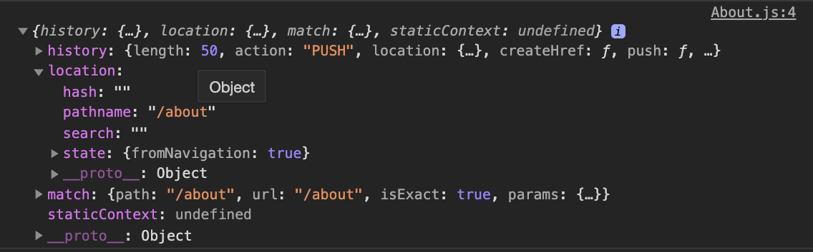

#### 6.0 Getting Ready for the Router

메뉴를 만들고 조금 더 인터렉션을 추가해보자.

메뉴를 만들기 위해 `react-router-dom`을 쓸 거야.

1. `npm install react-router-dom`

#### 6.1 Building the Router

```JSX
// App.js

import { HashRouter, Route } from "react-router-dom";
import Home from "./routes/Home";
import About from "./routes/About";

function App() {
  return (
    <HashRouter>
      <Route path="/" component={Home} />
      <Route path="/about" component={About} />
      {/* Route 안에는 중요한 props가 두 개 들어간다. 하나는 렌더링 할 스크린, 다른 하나는 what url is going to do.*/}
    </HashRouter>
  );
}

export default App;
```

이렇게 하면 `/home` 에서는 Home 이 제대로 보이지만 `/about` 에서는 Home과 About 페이지가 함께 렌더링 되어 한 페이지에 모두 보이는 현상이 발생한다! 왜냐면 리액트 라우터가 /를 보고 Home을 렌더링하고, /about을 보고 또 About을 렌더링 하기 때문이다.

```JSX
function App() {
  return (
    <HashRouter>
      <Route path="/" exact={true} component={Home} />
      <Route path="/about" component={About} />
      {/* Route 안에는 중요한 props가 두 개 들어간다. 하나는 렌더링 할 스크린, 다른 하나는 what url is going to do.*/}
    </HashRouter>
  );
}

export default App;
```

`/` 에 `exact={true}` 를 넣어주면 exactly "/" 일 때만 렌더링 한다!

#### 6.2 Building the Navigation

```JSX
function Navigation() {
  return (
    <div>
      <a href="/">Home</a>
      <a href="/about">About</a>
    </div>
  );
}

export default Navigation;
```

```JSX
function App() {
  return (
    <HashRouter>
      <Navigation />
      <Route path="/" exact={true} component={Home} />
      <Route path="/about" component={About} />
    </HashRouter>
  );
}
```

Navigation 컴포넌트를 이렇게 만들고 렌더링 하면 문제점이 발생한다.

1. 링크를 클릭할 때마다 페이지를 완전히 새로고침 시켜버리고,
2. `/about` 으로는 링크 이동이 불가능하다.

```JSX
function Navigation() {
  return (
    <div className="nav">
      <Link to="/">Home</Link>
      <Link to="/about">About</Link>
    </div>
  );
}
```

`a href` 대신 `Link to` 를 써서 보완할 수 있다 :)
App 컴포넌트에서 `<HashRouter>` 안에는 링크와 관련된 컴포넌트/라우트만 오면 된다 :) 다른건 밖으로 빼줘도 괜찮아.
<br/><br/>

`HashRouter`에서는 라우트에 `http://localhost:3000/#/` 이렇게 해쉬태그가 붇는다. `HashRouter`를 `BrowserRouter`로 바꾸면 해쉬태그가 없어짐. 그런데 BrowserRouter은 github pages에 설정하는 것이 조금 번거로움.

#### 6.3 Sharing Props Between Routes

영화 카드를 클릭해 상세페이지로 넘어가도록 만들어 보자! 그 전에 route props 라는 걸 배워야 함. 모든 컴포넌트에는 props이 있다.

```JSX
function About(props) {
  console.log(props);
  return (
    <div className="about__container">
      <span>
        “Freedom is the freedom to say that two plus two make four. If that is
        granted, all else follows.”
      </span>
      <span>− George Orwell, 1984</span>
    </div>
  );
}
```

 <br/><br/>

이 prop들은 react-route에 의해 넣어진 것이고 아직 about으로 전송되지 않았음. 라우터에 있는 모든 라우트들은 props를 기본값으로 갖는다.
우리는 이 prop을 이용할 수 있는데 예를 들어 유저가 about을 클릭할 때 정보를 보낼 수 있다! 이것을 이용해 유저가 영화를 클릭하면 영화 상세 페이지로 넘어가고, 그때 모든 데이터를 보내는 걸 해볼거야!
react-route는 to로 객체를 보내는 것을 허락한다.[공식문서 참고!](https://reactrouter.com/web/api/Link/to-object)

<br/><br/>

```JSX
function Navigation() {
  return (
    <div className="nav">
      <Link to="/">Home</Link>
      <Link
        to={{
          pathname: "/about",
          state: {
            fromNavigation: true,
          },
        }}
      >
        About
      </Link>
    </div>
  );
}
```

about 페이지(라우트)로 object 를 보낸다!

<br/><br/>

```JSX
function Movie({ title, year, summary, poster, genres }) {
  return (
    <Link to={{
        pathname: "/movie-detail",
        state: { year, title, summary, poster, genres }
        }}
    >
      <div className="movie">
        
        <div className="movie__data">
          <h3 className="movie__title">{title}</h3>
          <h5 className="movie__year">{year}</h5>
          <ul className="movie__genres">
            {genres.map((genre, index) => (
              <li key={index} className="genres__genre">
                {genre}
              </li>
            ))}
          </ul>
          <p className="movie__summary">{summary.slice(0, 140)}...</p>
        </div>
      </div>
    </Link>
  );
}
```

```JSX
function Detail(props) {
  console.log(props);
  return <span>helllllllo</span>;
}

export default Detail;
```

 <br/><br/>

#### 6.4 Redirecting

---

[목록으로](../../README.md) / [이전으로](../chapter-05/README.md)

1. [SETUP](../chapter-01/README.md)
2. [JSX & PROPS](../chapter-02/README.md)
3. [STATE](../chapter-03/README.md)
4. [MAKING THE MOVIE APP](../chapter-04/README.md)
5. [CONCLUSIONS](../chapter-05/README.md)
6. [ROUTING BONUS](../chapter-06/README.md)
